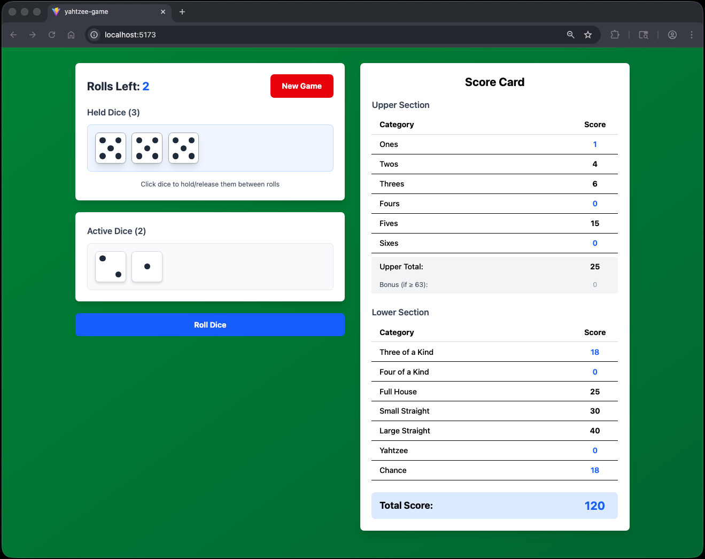
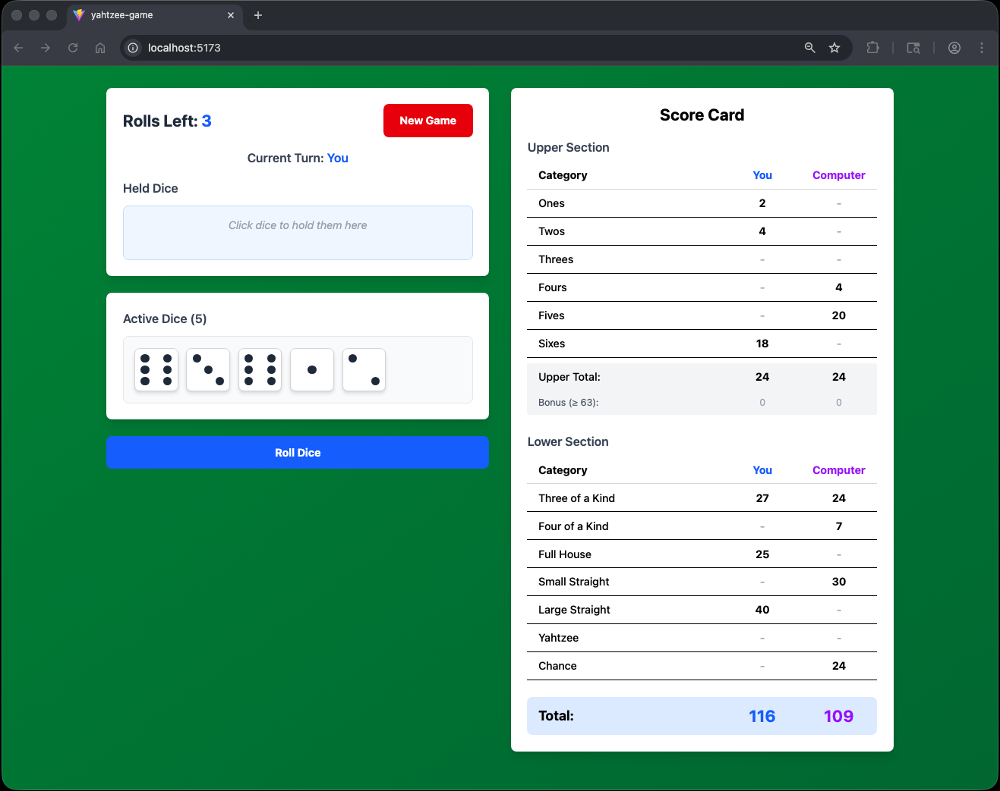

# Yahtzee Game 🎲

Yahtzee is a classic dice game where players roll five dice up to three times per turn, trying to achieve specific scoring combinations. 

This is a single-player web-based implementation of Yahtzee, built to run locally in your browser. The game features an intuitive click-to-hold dice mechanism, real-time score previews, and a clean, responsive interface.

### How to Play

1. **Roll the Dice**: Click the "Roll Dice" button to roll all five dice (you get 3 rolls per turn)
2. **Hold Dice**: After rolling, click any die to hold it - held dice move to the blue "Held Dice" area and won't be re-rolled
3. **Release Dice**: Click a held die to release it back to the "Active Dice" area
4. **Score**: After using at least one roll, click a category in the scorecard to lock in your score
5. **Repeat**: Continue for all 13 categories to complete the game

### Scoring Categories

**Upper Section** (score = sum of matching dice)
- **Ones**: Sum of all 1s
- **Twos**: Sum of all 2s
- **Threes**: Sum of all 3s
- **Fours**: Sum of all 4s
- **Fives**: Sum of all 5s
- **Sixes**: Sum of all 6s
- **Bonus**: 35 points if upper section totals 63 or more

**Lower Section**
- **Three of a Kind**: At least 3 dice showing the same value (score = sum of all dice)
- **Four of a Kind**: At least 4 dice showing the same value (score = sum of all dice)
- **Full House**: 3 of one value and 2 of another (25 points)
- **Small Straight**: 4 sequential dice (30 points)
- **Large Straight**: 5 sequential dice (40 points)
- **Yahtzee**: All 5 dice showing the same value (50 points)
- **Chance**: Any combination (score = sum of all dice)

### Game Rules

- Each category can only be used once per game
- You must fill one category each turn, even if it scores 0 points
- The game ends after all 13 categories are filled
- Your final score includes the upper section bonus if earned

## How to Run

### Prerequisites

- Node.js (v16 or higher)
- npm (comes with Node.js)

### Installation & Setup

1. **Clone or download this project**

2. **Install dependencies**
   ```bash
   npm install
   ```

3. **Start the development server**
   ```bash
   npm run dev
   ```

4. **Open your browser**
   
   Navigate to `http://localhost:5173` to play the game

5. **Stop the server**
   
   Press `Ctrl+C` in the terminal, or run:
   ```bash
   pkill -f "vite"
   ```


## Enjoy the Game!

Roll the dice, strategize your scoring, and try to beat your high score! 🎲





